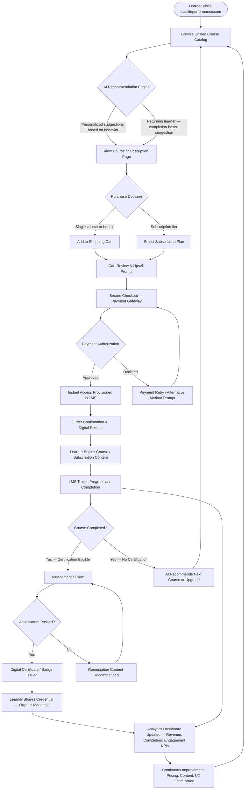

# Optimizing FSA Elite Performance Website for Revenue Generation

---

## Executive Summary

FSA Elite Performance stands at a pivotal moment. As a provider of high-value athletic and professional-development training content, the organization has the opportunity to transform its website, `fsaeliteperformance.com`, into a robust, revenue-generating platform that serves clients at every stage of their development journey. Achieving that transformation requires three interlocking pillars: an uncompromising commitment to cybersecurity and data stewardship, a carefully constructed monetization architecture built on modern eLearning commerce principles, and a deeply integrated Learning Management System (LMS) connected seamlessly to an eCommerce engine.

This report synthesizes guidance from three authoritative sources: the **Federal Trade Commission's "Start with Security: A Guide for Business"** (hereafter, the FTC guide), **SimpliTrain's "Ways to Monetize Training Content: eCommerce Integration"** (hereafter, SimpliTrain), and **MapleLMS's "Maximize Revenue with LMS and eCommerce Integration"** (hereafter, MapleLMS). Drawing exclusively on these materials, the report provides a strategic framework and concrete recommendations for FSA Elite Performance to maximize revenue while protecting user trust and maintaining regulatory compliance.

Key findings include:

- Security is not optional; it is the prerequisite for every revenue-generating function on the site. Data breaches destroy user confidence and expose the organization to regulatory and legal consequences that can dwarf any short-term revenue gains.
- The global eLearning market is expanding at a compound annual growth rate (CAGR) of **8.56% from 2024 to 2029** (SimpliTrain). FSA Elite Performance must position itself to capture a share of that growth through diversified monetization models: subscription tiers, pay-per-course access, and credentialing programs.
- LMS platforms with native eCommerce capabilities—or tightly integrated third-party connections—dramatically outperform systems that treat learning and commerce as separate concerns. Unified storefronts, intelligent shopping carts, seamless payment gateways, and AI-powered recommendation engines collectively drive higher transaction values, lower cart-abandonment rates, and sustained learner engagement.
- A practical synthesis of these three pillars produces a roadmap that FSA Elite Performance can follow, from immediate security hardening through to advanced AI-driven upselling, to transform the website into a self-sustaining revenue engine.

---

## Introduction

FSA Elite Performance exists to help athletes, coaches, and performance professionals reach the highest levels of their craft. Its training programs, certifications, and performance-coaching content are differentiated products in a competitive marketplace. Yet, like many specialized training organizations, FSA Elite Performance faces the challenge of converting high-quality expertise into consistent, scalable, and protected digital revenue streams.

The website `fsaeliteperformance.com` is simultaneously a marketing channel, a storefront, a delivery platform, and a trust signal to prospective clients. Every element of the user experience—from the first page load to the final certificate download—shapes whether a visitor becomes a paying customer, whether a customer returns, and whether a loyal community member refers new learners.

To optimize this experience for revenue generation, the website's strategy must address three interconnected domains:

**Domain 1: Security.** Online commerce is built on trust, and trust is inseparable from security. When users provide payment information, personal details, or sensitive health and performance data, they are extending a significant degree of confidence to FSA Elite Performance. The FTC guide provides a practical, principle-based framework for earning and sustaining that confidence through organizational discipline, technical controls, and vendor accountability.

**Domain 2: Monetization Strategy.** Having great content is a necessary but insufficient condition for revenue. Organizations must make deliberate choices about *how* that content is packaged, priced, and presented. SimpliTrain's analysis of eLearning monetization identifies multiple viable models—subscriptions, pay-per-course access, bundled certifications—and explores the compliance considerations, challenges, and analytics capabilities that separate successful implementations from those that plateau or fail.

**Domain 3: LMS–eCommerce Integration.** The technical and experiential architecture of the site must make purchasing effortless and discovery irresistible. MapleLMS provides a detailed framework for how the convergence of an LMS with eCommerce functionality—whether built-in or via third-party integrations—unlocks new revenue opportunities through centralized catalog management, AI-powered recommendations, and real-time analytics.

This report addresses each domain in depth and then synthesizes the insights into a comprehensive set of recommendations tailored to the specific needs and opportunities of FSA Elite Performance.

---

## Security as the Foundation for Elite Performance

Before FSA Elite Performance can realistically pursue ambitious revenue targets, it must establish an unshakeable security foundation. A breach in security—whether a data leak, a compromised payment flow, or unauthorized access to training content—can erode years of brand equity, result in significant financial penalties, and drive clients permanently to competitors. The FTC guide provides an accessible, practical framework that every business offering online products and services should implement.

### Starting with Security

The FTC guide's most fundamental principle is deceptively simple: **make security a priority from the very beginning**, not an afterthought bolted on after a product is already in users' hands. For FSA Elite Performance, this means treating every new feature, every new content type, every new integration, and every new vendor relationship as a potential security surface that requires deliberate evaluation.

The FTC emphasizes that reasonable data security for businesses depends on the nature and sensitivity of the information involved, the size and complexity of the business, the cost of available tools, and the severity of the risk. This contextual framing is important: FSA Elite Performance does not need to implement enterprise-grade security controls designed for a Fortune 500 financial institution. However, it does need to implement controls that are proportionate to the sensitivity of the data it handles—which includes payment card information, personally identifiable information (PII) of athletes and coaches, and potentially performance-related health data.

The FTC guide makes clear that businesses that fail to provide reasonable data security for sensitive consumer information can face FTC action. This is not a theoretical threat. The cost of a security breach—in terms of legal exposure, regulatory scrutiny, remediation expenses, reputational damage, and lost revenue—almost always exceeds the cost of proactive security investment. For FSA Elite Performance, this calculus is especially relevant because its audience—performance-oriented professionals and athletes—places a premium on trust, integrity, and consistency.

**Practical implication for FSA Elite Performance:** Establish a written security policy before launching any new revenue-generating feature. The policy should clearly assign responsibility for security decisions, establish a process for evaluating new vendors and integrations, and set minimum standards for data handling across the organization.

The FTC guide further advises that businesses should inventory the personal information they hold, understand how it flows through their systems, and proactively identify where that information might be vulnerable. For a training platform, this inventory should include: account registration data (names, email addresses, passwords), payment information, course enrollment records, completion records, certificate information, and any communication data (forum posts, coach messages, direct messages).

Conducting this inventory is not a one-time exercise. As FSA Elite Performance adds new monetization features, new content types, and new integrations, the data inventory must be updated to reflect the expanded surface area. This ongoing discipline is the foundation on which every other security control rests.

### Data Collection, Retention, and Access Control

The FTC guide's second major area of guidance concerns what data businesses collect, how long they keep it, and who within the organization has access to it. These three considerations are deeply interrelated: the less data you collect, the less you need to protect; the shorter you retain data, the smaller the window of exposure; and the fewer people who have access to sensitive data, the less likely it is to be compromised.

**Data Minimization.** The FTC guide strongly recommends that businesses collect only the information they actually need to provide their services. For FSA Elite Performance, this means resisting the temptation to collect extensive demographic, behavioral, or performance data "just in case" it becomes useful later. Every additional data point is a liability: it must be stored securely, protected from unauthorized access, and disposed of properly when no longer needed.

In the context of an eLearning and eCommerce platform, necessary data includes: name and contact information for account creation and communication, payment information for purchase processing (ideally tokenized and never stored in raw form), course enrollment and completion status for access control and certification, and billing history for customer service. Data that is not clearly necessary for these core functions should not be collected.

**Data Retention.** The FTC guide emphasizes that businesses should develop and enforce a data retention policy that specifies how long different types of information are kept and how they are destroyed when no longer needed. For FSA Elite Performance, a reasonable retention schedule might keep active account data as long as the account is active, payment records for the period required by tax and accounting regulations, and completion records long-term (since certifications may need to be verified). Data associated with inactive accounts—particularly payment information—should be purged on a regular schedule.

This principle has a direct revenue implication: some training organizations are tempted to retain large amounts of user data to support future marketing campaigns. The FTC guide's guidance suggests that this approach carries risk. A more privacy-respecting approach is to collect meaningful consent for marketing communications and retain only the data needed to honor that consent, rather than accumulating speculative data stores.

**Access Control.** The FTC guide stresses that employees should have access only to the data they need to do their jobs—a principle known as "least privilege." For FSA Elite Performance, this means segmenting access so that, for example, content creators can access the LMS to upload and organize materials but cannot view payment records; customer service representatives can access billing history but cannot modify course content; and administrators can access all systems but only from authenticated, audited sessions.

Access control is particularly important in a small or growing organization, where informal norms can lead to broad access permissions being granted as a matter of convenience. The FTC guide recommends establishing clear access policies, implementing technical controls to enforce them, and auditing access logs regularly. When employees leave the organization, their access should be revoked immediately—a step that is frequently overlooked but represents a significant security risk.

**Practical implication for FSA Elite Performance:** Implement role-based access control (RBAC) in the LMS, the eCommerce platform, and any connected administrative systems. Assign roles based on job function and review access permissions at least quarterly. Maintain access logs and review them for anomalous activity.

### Authentication, Encryption, and Vulnerability Management

Beyond data governance, the FTC guide addresses three technical security pillars that are essential for any online business: authentication (who is allowed in?), encryption (is data protected in transit and at rest?), and vulnerability management (are known weaknesses being addressed?).

**Authentication.** The FTC guide emphasizes that businesses should require strong, unique passwords for all systems and should implement multi-factor authentication (MFA) wherever feasible. For FSA Elite Performance, this means:

- Requiring learners to set strong passwords when creating accounts, providing guidance on password strength, and using authentication libraries that store passwords as secure hashes (never in plaintext).
- Implementing MFA for administrative accounts, instructor accounts, and any account with elevated permissions.
- Using session timeouts and secure cookie practices to prevent session hijacking.
- Offering MFA as an option for all learner accounts, since many users accessing premium training content have an interest in protecting their credentials.

The FTC guide also warns against allowing default or easily guessable credentials on any system. Many data breaches stem not from sophisticated hacking but from administrative interfaces left open with factory-default usernames and passwords. FSA Elite Performance should audit all third-party systems, plugins, and integrations to ensure that default credentials have been changed and that all administrative access points are secured.

**Encryption.** The FTC guide specifically recommends that businesses protect sensitive data both in transit (using protocols like TLS/HTTPS) and at rest (using encryption for databases and storage containing sensitive information). For FSA Elite Performance, HTTPS across the entire website is not optional—it is the baseline. Any page that collects user input, handles payment information, or delivers authenticated content must be served over encrypted connections.

Payment data deserves special attention. The FTC guide's broader guidance on data security applies fully to payment information, which is also subject to industry-specific standards like the Payment Card Industry Data Security Standard (PCI DSS). The most effective way for FSA Elite Performance to manage payment security is to use a certified payment processor (such as Stripe or another PCI-compliant provider) and never handle or store raw card data directly. This approach transfers the most sensitive part of the payment process to a specialized provider with the resources and expertise to manage it securely.

At rest, any database containing user information, enrollment records, or business-sensitive data should be stored using encrypted storage. Backups—which are often forgotten in security planning—must also be encrypted and stored securely, with access limited to authorized personnel.

**Vulnerability Management.** The FTC guide stresses that businesses should have a plan to keep software current, monitor for security vulnerabilities, and respond to them promptly. For a Next.js–based platform like `fsaeliteperformance.com`, this means:

- Keeping the Next.js framework, React, and all npm dependencies updated to current versions. Dependabot and similar tools can automate alerts for known vulnerabilities in dependencies.
- Reviewing plugin and integration updates promptly and applying security patches within a defined SLA (e.g., critical patches within 24–72 hours; high-severity patches within one week).
- Conducting periodic security reviews of custom code, particularly any code that handles authentication, payment processing, data access, or content delivery.
- Performing penetration testing or vulnerability scanning at major development milestones and at least annually.

The FTC guide also emphasizes that businesses should segment their networks so that a compromise in one area does not cascade across the entire system. For FSA Elite Performance, this might mean ensuring that the administrative interface for the LMS is not accessible from the public internet without VPN or MFA, and that database servers are not directly internet-accessible.

**Service Provider Security.** The FTC guide dedicates specific attention to the security practices of third-party service providers. When FSA Elite Performance uses external vendors—payment processors, LMS platforms, email marketing services, analytics providers, cloud hosting—those vendors have access to FSA Elite Performance's data and systems. The FTC guide recommends that businesses include security requirements in contracts with service providers, verify that those providers have appropriate security measures in place, and monitor their performance over time.

In practical terms, FSA Elite Performance should maintain a vendor inventory, review the security policies and certifications (e.g., SOC 2, ISO 27001) of each significant vendor, and include data-processing agreements that specify what each vendor can do with the data it receives.

**Incident Response.** Finally, the FTC guide recommends that every business have an incident response plan: a documented process for identifying, containing, and recovering from a security incident, and for notifying affected individuals and regulators as required. For FSA Elite Performance, a basic incident response plan should identify who is responsible for security decisions, how a potential breach will be investigated, what the thresholds are for notifying users and authorities, and how business continuity will be maintained during an incident. Having this plan in place before an incident occurs dramatically reduces the damage when one inevitably does.

---

## Monetization Strategies for Training Content

With a solid security foundation in place, FSA Elite Performance can focus on the revenue-generating architecture of its platform. SimpliTrain's analysis of training content monetization through eCommerce integration provides a rich framework for understanding the options available and the considerations that shape success in each model.

### The eLearning Market Opportunity

SimpliTrain establishes the context for monetization by situating FSA Elite Performance within the broader eLearning industry. The global eLearning market is growing at a **compound annual growth rate (CAGR) of 8.56% from 2024 to 2029**. This sustained growth reflects fundamental shifts in how professionals and athletes consume training content: increasing preference for on-demand access, geographic independence, self-paced learning, and the ability to combine training with demanding competitive or professional schedules.

For FSA Elite Performance, this market dynamic is an opportunity. The organization's specialized focus on elite performance—combining sport-science principles, professional development methodologies, and elite coaching techniques—differentiates it from general-purpose eLearning platforms. Specialized providers with distinct methodologies and credentialed instructors are well-positioned to capture above-average value from a growing market, provided they monetize that content effectively.

The key insight from SimpliTrain is that monetization is not a single decision. It is a portfolio of decisions: which content to monetize, through which model, at what price point, and for which audience segment. Building a diversified monetization portfolio reduces dependence on any single revenue stream and creates multiple entry points for learners with different needs, budgets, and levels of commitment.

### Subscription Models and Recurring Revenue Streams

SimpliTrain identifies subscription models as one of the most powerful monetization structures for training content, and for good reason: they convert what would otherwise be one-time transactions into ongoing, predictable revenue relationships.

In a subscription model, learners pay a recurring fee—monthly, quarterly, or annually—in exchange for access to a defined library of content. The specific structure of the subscription offering determines its revenue characteristics and learner appeal.

**Tiered Subscriptions.** FSA Elite Performance can implement a tiered subscription architecture that segments the learner population by their level of commitment and willingness to pay:

- *Entry Tier:* Access to foundational content—introductory training modules, general fitness science, and basic performance principles. This tier serves as a low-friction entry point for prospective clients and is priced to maximize volume.
- *Professional Tier:* Access to intermediate and advanced training content, including program design, periodization strategies, and performance analytics modules. This tier targets practicing coaches and serious athletes who need structured professional development.
- *Elite Tier:* Full access to all content, including premium coach-led sessions, exclusive masterclasses, live group sessions, and direct feedback from FSA-certified instructors. This tier targets elite performers and organizational clients seeking the highest level of engagement.

SimpliTrain emphasizes that tiered subscriptions work best when each tier delivers clear, distinct value that learners can articulate to themselves and others. If the differentiation between tiers is unclear, learners will gravitate to the lowest tier (or no tier at all), and the revenue potential of higher tiers will not be realized.

**Annual vs. Monthly Subscriptions.** SimpliTrain notes that annual subscriptions provide greater revenue predictability and often command a lower effective monthly rate as a benefit to the learner. From FSA Elite Performance's perspective, annual subscriptions reduce the cost of monthly billing cycles, improve cash flow planning, and increase the likelihood that learners will complete more content (since they have committed to a longer engagement). Monthly subscriptions lower the barrier to entry but require ongoing engagement to prevent churn.

A practical approach is to offer both, with the annual option priced to provide a meaningful discount (SimpliTrain's analysis supports the principle that learners respond to perceived savings) while still generating higher total revenue per user than a sequence of monthly payments that terminates early due to churn.

**Team and Organizational Subscriptions.** SimpliTrain highlights that B2B (business-to-business) subscription deals—where organizations purchase access for multiple team members—typically generate significantly higher average contract values than individual subscriptions. For FSA Elite Performance, this means marketing directly to sports organizations, coaching academies, athletic departments, and corporate wellness programs that may want to enroll entire teams or cohorts. A single organizational contract can deliver the revenue equivalent of dozens or hundreds of individual subscriptions.

**Recurring Revenue and Community Value.** One of SimpliTrain's key insights about subscription models is that the most sustainable subscriptions are not just about content access—they are about ongoing community membership and continuous value delivery. FSA Elite Performance can increase subscription retention by adding recurring-value elements such as: monthly live Q&A sessions with elite coaches, periodic content updates and new module releases, community forums where subscribers interact with peers and instructors, and exclusive access to performance tracking tools or analytics dashboards.

When subscribers feel they are part of an evolving, living platform rather than a static content library, their propensity to cancel decreases and their lifetime value increases.

### Pay-Per-Course and Certification Programs

While subscriptions generate recurring revenue, pay-per-course and certification programs generate transactional revenue and serve learners who prefer to make specific, targeted purchases rather than ongoing commitments.

**Pay-Per-Course Access.** In a pay-per-course model, learners purchase access to a specific course or module without committing to a subscription. SimpliTrain identifies this model as particularly effective for high-value, specialized content where the learner has a specific, immediate need—for example, a coach looking to earn continuing education credits in a particular area, or an athlete preparing for a specific competitive season.

For FSA Elite Performance, the pay-per-course catalog should feature courses with clear, specific value propositions: identifiable skills to be developed, concrete outcomes to be achieved, and applications directly relevant to the learner's practice. Courses should be priced to reflect their depth, duration, and the expertise of the instructors involved.

SimpliTrain notes that pay-per-course pricing creates an interesting strategic opportunity: courses that are included in the subscription library but also available for individual purchase can serve as a discovery mechanism. A learner who purchases a single course as a one-time transaction and has a positive experience is a high-probability candidate for a subscription upgrade.

**Certification Programs.** SimpliTrain gives particular attention to certification programs as a high-value monetization vehicle. Certifications serve a different psychological and professional function than ordinary courses: they confer credential value that learners can display to employers, clients, and peers. Because certifications carry external signaling value, learners are typically willing to pay premium prices for them.

For FSA Elite Performance, certification programs represent perhaps the highest-value monetization opportunity in its portfolio. A certification in, for example, "Elite Athletic Performance Programming" or "FSA Strength and Conditioning for Professional Athletes" carries not just educational value but professional identity value. Certified coaches and trainers can reference their FSA credentials when marketing their own services, creating a network effect that motivates additional certifications and keeps FSA Elite Performance's brand active in the professional ecosystem.

SimpliTrain identifies several structural elements of effective certification programs:

- *Prerequisites and pathways:* Certifications should sit at the apex of a structured learning pathway. Requiring learners to complete foundational and intermediate courses before qualifying for a certification creates a natural revenue funnel that increases total spending per learner.
- *Assessment and proctoring:* Meaningful assessment—written exams, practical demonstrations, peer review, or instructor evaluation—is essential for maintaining the credibility and therefore the commercial value of certifications. SimpliTrain notes that credentialing programs perceived as "too easy" rapidly lose their value proposition.
- *Renewal and continuing education:* Certifications that require periodic renewal (e.g., every two to three years) generate recurring revenue from certified professionals. Renewal requirements can include continuing education units (CEUs), which in turn drive additional course purchases and subscription retention.
- *Digital credentials and badging:* Digital credential platforms allow FSA Elite Performance to issue verifiable, shareable digital badges and certificates. When certified learners share these credentials on professional networks, they create organic marketing impressions for FSA Elite Performance among new potential learners.

**Course Bundles.** SimpliTrain also discusses course bundles as a revenue optimization strategy. By grouping related courses at a package price below what individual courses would cost in total, FSA Elite Performance can increase average order value, encourage deeper engagement with the content library, and accelerate learner progress along defined pathways. Bundles work particularly well when they are structured around a coherent theme or learning outcome—for example, a "Performance Nutrition for Elite Athletes" bundle, or a "Certification Preparation Bundle" that groups everything a learner needs to attempt a specific certification exam.

### Challenges, Compliance, and Analytics in Monetization

SimpliTrain does not present eLearning monetization as a frictionless path to revenue. It identifies a range of challenges and compliance considerations that organizations must navigate, as well as the analytical frameworks needed to optimize monetization over time.

**Payment Processing and Compliance.** Any organization accepting online payments must navigate a complex landscape of payment processing requirements. SimpliTrain notes that organizations must work with reputable payment processors and comply with the applicable standards for card-not-present transactions. As described in the security section of this report, leveraging a certified payment processor—and never storing raw payment data—is both a security best practice and a compliance imperative.

Beyond payment processing, FSA Elite Performance must also consider compliance with consumer protection laws that govern subscription services. In many jurisdictions, subscription services are required to disclose recurring charges clearly at the point of sale, obtain affirmative consent before enrolling users in auto-renewal programs, and provide simple, accessible cancellation mechanisms. SimpliTrain emphasizes that transparent, user-friendly subscription management—including easy cancellation—builds trust and reduces the churn that results from frustrated users who feel trapped in subscriptions they did not fully understand.

**Access Management and Content Entitlement.** A common challenge identified by SimpliTrain is ensuring that users have access only to the content they have purchased and that this access is correctly provisioned and de-provisioned as subscriptions lapse or payment methods fail. Robust entitlement management—ideally handled automatically by the LMS/eCommerce integration—prevents both unauthorized access (which represents revenue leakage and a potential compliance issue) and false access denials (which drive support costs and user frustration).

**Pricing Experimentation.** SimpliTrain stresses that pricing for training content is not static. Organizations that adopt a data-driven approach to pricing—testing different price points, bundle configurations, and promotional structures—consistently outperform those that set prices once and never revisit them. For FSA Elite Performance, this means building analytics capabilities that track the relationship between pricing decisions and conversion rates, average order values, and retention rates.

**Analytics for Monetization Optimization.** SimpliTrain identifies analytics as a fundamental enabler of monetization improvement. Key metrics that FSA Elite Performance should track include:

- *Conversion rate by entry point:* What percentage of visitors to each course or subscription landing page convert to paying customers? Which content types generate the highest conversion rates, and why?
- *Average order value (AOV):* What is the average transaction value across all purchase types? How does this change in response to bundle offers, upsell prompts, or promotional pricing?
- *Customer lifetime value (CLV):* What is the total revenue generated per customer over the duration of their relationship with FSA Elite Performance? How do CLV figures differ by subscription tier, cohort, and acquisition channel?
- *Churn rate:* What percentage of subscribers cancel each billing period? What actions predict churn, and at what point in the subscriber journey is churn most likely?
- *Course completion rate:* Learners who complete courses are more likely to purchase additional courses and certifications. Tracking completion rates—and identifying the content and experience factors that drive or prevent completion—is essential for both engagement and revenue optimization.

SimpliTrain notes that organizations that build a culture of measurement around these KPIs are better positioned to iterate their monetization models over time, respond quickly to market changes, and allocate resources toward the highest-value opportunities.

---

## LMS and eCommerce Integration: Boosting Sales and Engagement

With a clear monetization strategy defined, FSA Elite Performance's next challenge is building the technical and experiential infrastructure to execute it. MapleLMS provides a detailed framework for how LMS platforms can be integrated with eCommerce functionality to create a seamless purchasing and learning experience that maximizes revenue.

### Built-in eCommerce vs. Third-Party Integrations

MapleLMS describes two primary approaches to connecting learning management with eCommerce capabilities: built-in eCommerce features native to the LMS itself, and third-party eCommerce platform integrations.

**Built-in eCommerce.** Some modern LMS platforms include native eCommerce functionality—shopping carts, payment gateways, coupon management, subscription handling, and storefront features—that are built directly into the platform. MapleLMS notes that built-in eCommerce offers significant advantages in terms of simplicity, cohesion, and reduced technical overhead. When the LMS and the commerce layer are designed together, the user experience tends to be more seamless: purchase and enrollment happen in a single flow, access to purchased content is provisioned immediately, and there is no data synchronization required between separate systems.

For FSA Elite Performance, a built-in eCommerce LMS is the lowest-friction option and is particularly appropriate if the organization's primary sales channel is direct-to-consumer training content. The FSA Elite Performance website is built on Next.js and already incorporates Stripe for payment processing, which aligns well with the built-in approach: the application itself serves as both the storefront and the learning delivery platform.

**Third-Party eCommerce Integrations.** MapleLMS also describes the alternative approach: connecting a standalone LMS to a specialized eCommerce platform (such as Shopify, WooCommerce, or Magento) via APIs or pre-built connectors. This approach is more complex but may be appropriate when:

- The organization's product catalog extends beyond digital training content to include physical merchandise, equipment, supplements, or other tangible goods.
- The organization requires advanced eCommerce features—complex discount engines, multi-currency support, tax calculation engines, affiliate marketing systems—that are not available in a built-in LMS commerce module.
- The organization already has an established eCommerce presence on a platform and wishes to add LMS functionality rather than migrating existing data.

MapleLMS notes that third-party integrations introduce complexity: data must be synchronized between systems, user accounts must be managed consistently across platforms, and the risk of integration failures must be managed. However, when the functionality requirements justify the complexity, a well-implemented third-party integration can provide best-of-breed capabilities in both the learning and commerce dimensions.

**Recommendation for FSA Elite Performance.** Based on the MapleLMS framework, FSA Elite Performance's current architecture—a Next.js application with Stripe integration—represents a foundation for built-in eCommerce. Extending this architecture to incorporate LMS capabilities (or integrating a specialized LMS with the existing payment infrastructure via API) is the most natural evolution. The key decision point is whether the LMS platform selected includes sufficient native commerce features, or whether the existing Next.js/Stripe infrastructure is sufficient to serve as the commerce layer while a dedicated LMS handles content delivery and learner management.

### Benefits of Integrated Storefront, Shopping Cart, and Payment Gateways

MapleLMS identifies a set of core benefits that accrue when the storefront, shopping cart, and payment gateway are integrated into a unified learner experience. These benefits extend beyond mere technical convenience: they directly drive revenue by reducing friction, increasing conversion rates, and enabling upselling and cross-selling.

**Unified Storefront.** MapleLMS describes the benefits of a single, cohesive storefront that presents the full course and subscription catalog in a visually consistent, searchable, and filterable interface. When learners can browse the complete catalog, read course descriptions, view instructor credentials, preview sample content, and read reviews—all within a single interface—the probability that they will find something worth purchasing increases substantially.

A fragmented storefront—where some courses are hosted on one platform, subscriptions are managed elsewhere, and certifications require a separate registration process—creates unnecessary friction and may lose learners who encounter confusion at any step. MapleLMS emphasizes that the storefront should present a learner-centric view of the catalog, organized around learning outcomes and career pathways rather than internal organizational categories.

For FSA Elite Performance, the storefront should be designed to guide learners through a journey: from awareness of available content, to interest in a specific pathway, to a purchase decision supported by clear value statements and social proof, to seamless checkout. Every stage of this journey should be optimized to reduce drop-off and increase conversion.

**Shopping Cart.** MapleLMS highlights the shopping cart as a critical revenue-optimization touchpoint. A well-designed cart in a training content context does more than collect items before checkout: it serves as an active upselling and cross-selling surface. When a learner adds a course to their cart, the cart interface can display related courses, recommended certification pathways, or subscription options that would include the selected course and additional content at a better effective price per item.

Cart abandonment is a significant challenge in eCommerce generally, and in training content commerce specifically. MapleLMS notes that abandoned cart recovery—through automated reminder emails or retargeting—can recover a meaningful percentage of otherwise lost revenue. However, recovery only works if the cart session is persisted (so that a learner who returns after abandoning finds their previous selection intact) and if the reminder communication is relevant and timely.

**Payment Gateways.** MapleLMS emphasizes that a reliable, multi-option payment gateway is a fundamental requirement for maximizing conversion rates. Learners have different payment preferences: some prefer credit or debit cards, others prefer digital wallets (like Apple Pay or Google Pay), and organizational purchasers may require invoice-based or purchase-order payment flows. A payment gateway that supports multiple methods—and that presents a clean, trustworthy checkout interface—reduces the number of conversions lost at the final payment step.

From a security perspective (reinforcing the FTC guide's guidance), MapleLMS recommends using payment gateways that are PCI DSS certified and that handle card data tokenization, so that the training platform never needs to store sensitive payment credentials. This configuration both reduces compliance burden and, critically, protects learners' financial information.

MapleLMS also highlights the importance of transparent pricing, clear disclosure of subscription terms and renewal schedules, and easily accessible receipts and billing history. These features are not just compliance requirements—they are trust signals that make learners more comfortable completing purchases and more likely to return for future transactions.

### AI-Powered Recommendations and Centralized Catalog Management

Two of the most strategically significant capabilities described by MapleLMS are AI-powered recommendation engines and centralized catalog management. Together, these features represent the leading edge of how modern LMS/eCommerce platforms drive learner engagement and revenue simultaneously.

**AI-Powered Recommendations.** MapleLMS describes AI-powered recommendation engines as a transformative tool for increasing average order value and learner engagement. By analyzing learner behavior—courses browsed, courses purchased, content completion rates, assessment performance, and peer patterns—an AI recommendation engine can surface personalized suggestions that are significantly more relevant than generic "bestsellers" lists.

For FSA Elite Performance, AI-powered recommendations could manifest in several high-value ways:

- *Learning pathway recommendations:* When a learner completes a foundational course, the system recommends the next logical step in their development pathway. This increases the average number of courses purchased per learner and accelerates credential attainment, which in turn generates re-enrollment for certification maintenance.
- *Complementary content:* When a learner is engaged with strength-and-conditioning content, the system recommends complementary modules in performance nutrition, recovery protocols, or psychological performance—expanding the learner's understanding and FSA Elite Performance's revenue per learner.
- *Personalized pricing and bundle offers:* AI can identify moments when a learner is most likely to respond to a bundle offer or a subscription upgrade prompt—for example, after completing their third individual course purchase—and present that offer at the optimal moment.
- *Churn prediction and retention intervention:* By identifying patterns associated with subscription churn (declining login frequency, incomplete course progress, skipped content updates), AI can trigger proactive retention interventions—personalized outreach from a coach, a special offer on a relevant advanced course, or an invitation to a community event.

MapleLMS emphasizes that the value of AI recommendations depends heavily on the quality and quantity of behavioral data available. This reinforces the analytics capability discussed in the SimpliTrain section: the more comprehensively FSA Elite Performance tracks learner behavior, the more accurately its AI systems can generate useful recommendations.

**Centralized Catalog Management.** MapleLMS identifies centralized catalog management as a fundamental operational capability for any organization with a substantial content library. When courses, certifications, subscriptions, and bundles are managed through a single administrative interface—rather than being scattered across multiple platforms with different data models—the organization gains several critical advantages:

- *Consistency:* Course descriptions, pricing, prerequisites, and metadata are maintained in one place and reflected consistently across every surface where the content appears (storefront, search results, recommendation engine, learner dashboard).
- *Speed to market:* New content can be published, priced, and made available for purchase without requiring coordination across multiple systems. This agility is especially valuable during promotional periods, content launches, and seasonal campaigns.
- *Analytics integration:* When all content is managed in a single catalog, performance analytics—enrollments, completion rates, revenue by course—are easy to aggregate and act on. Organizations that manage content across multiple fragmented systems often struggle to produce a coherent view of their catalog's performance.
- *Pricing management:* Discounts, coupons, promotional codes, and tiered pricing can be applied consistently across the catalog without risk of conflicting configurations in separate systems.

For FSA Elite Performance, centralizing catalog management means choosing a primary platform (LMS, eCommerce, or a unified system) as the system of record for all content and pricing information, and ensuring that every other system (website storefront, recommendation engine, reporting tools) consumes data from that central source rather than maintaining its own parallel data store.

**Real-Time Analytics Dashboard.** MapleLMS also describes the value of a real-time analytics dashboard that gives business leaders a current view of key revenue and engagement metrics. For FSA Elite Performance, this dashboard should display: current active subscriptions by tier, daily and weekly revenue by product type, course enrollment and completion rates, cart abandonment rates, top-performing and underperforming catalog items, and learner NPS (Net Promoter Score) or satisfaction ratings.

Access to real-time data enables faster decision-making: if a new course is underperforming in its first week, the team can quickly identify whether the issue is visibility (insufficient storefront placement), pricing (learners are browsing but not converting), or content (learners are enrolling but not completing). Each diagnosis suggests a different intervention, and the ability to iterate quickly is a significant competitive advantage.

---

## Synthesis: Optimizing the FSA Elite Performance Website for Revenue Generation

The three source frameworks—FTC security guidance, SimpliTrain monetization strategy, and MapleLMS integration architecture—converge on a coherent and mutually reinforcing vision for what `fsaeliteperformance.com` can become: a secure, intelligently designed, deeply integrated digital performance platform that generates sustainable, growing revenue while protecting and delighting the learners it serves.

### How Security Enables Monetization

It is tempting to treat security as a cost center and monetization as the revenue driver, with the two in tension. The synthesis of FTC guidance and SimpliTrain's monetization analysis reveals that this framing is incorrect: security directly enables monetization by establishing the trust environment in which learners are willing to make purchases, share personal information, and commit to recurring subscriptions.

A learner who encounters a security warning, experiences a data breach, or feels that their payment information is not protected will not simply hesitate to make a purchase—they will share their concern with others, leave negative reviews, and potentially reverse charges with their payment provider. The reputational and financial damage from a single significant security incident can eliminate months of revenue gains.

Conversely, an organization that prominently communicates its security practices—displaying SSL certificates, explaining its data privacy policy clearly, offering transparency about how data is used—converts security investment into a marketing advantage. FSA Elite Performance should position its security credentials as a differentiator, particularly given that its audience includes organizational clients (sports teams, academies, corporate wellness programs) who have their own compliance obligations and will require assurance about the security practices of their training content vendors.

### How Security Supports Compliance

SimpliTrain identifies compliance as a significant challenge in training content monetization—particularly around subscription disclosures, auto-renewal practices, and payment processing. The FTC guide's guidance on data security is directly relevant to these compliance obligations: the same discipline of clear documentation, process controls, and regular review that produces good security hygiene also produces good compliance posture.

FSA Elite Performance should treat compliance not as a distinct, separate workstream but as a natural extension of its security culture. When the organization builds a written security policy (as recommended by the FTC guide), that policy should include sections on payment processing, subscription disclosure, and consumer rights. When it implements access controls, those controls should encompass the systems that manage subscription renewals and billing data. When it responds to security incidents, those response procedures should include consumer notification protocols aligned with applicable law.

### How LMS Integration Amplifies Monetization

MapleLMS's integration framework provides the technical and experiential architecture that makes SimpliTrain's monetization strategies executable at scale. Without a unified platform, subscription management becomes operationally expensive (manually reconciling payment status with access entitlement), course bundling is difficult to present and manage, and AI-powered recommendations have no data foundation to operate on.

With a well-integrated LMS/eCommerce platform, FSA Elite Performance can automate the most operationally intensive aspects of monetization: enrolling subscribers automatically when payment is received, de-provisioning access when subscriptions lapse, sending targeted course recommendations based on individual learner history, and reporting revenue by product in real time without manual data aggregation.

This operational leverage allows FSA Elite Performance's team to focus on what they do best—creating and delivering elite performance training content—rather than managing complex, error-prone manual processes.

### Revenue Generation Model for FSA Elite Performance

Drawing all three frameworks together, the optimal revenue generation model for `fsaeliteperformance.com` combines the following elements:

1. **A tiered subscription offering** (Entry, Professional, Elite) as the primary recurring revenue stream, supported by annual subscription options that improve cash flow predictability and learner commitment.
2. **A rich pay-per-course and course bundle catalog** as the entry point for transactional buyers and as a conversion mechanism toward subscription.
3. **A portfolio of certification programs** at the apex of the learning journey, priced to reflect their credential value and requiring renewal for recurring revenue.
4. **An AI-powered recommendation engine** that personalizes the learner experience, increases average order value, and reduces churn through proactive retention interventions.
5. **A centralized catalog and storefront** that presents all offerings in a coherent, browseable, and searchable interface that guides learners toward the purchase most appropriate for their needs.
6. **Security and compliance infrastructure** that protects learner data, ensures payment processing integrity, and communicates trustworthiness to prospective clients.

---

## Recommendations for Enhancing Operational Performance and User Access

Translating the strategic synthesis above into operational practice requires a prioritized set of concrete actions. The following recommendations are grounded strictly in guidance from the three source documents.

### Recommendation 1: Establish a Written Security Policy

The FTC guide's foundational recommendation is to make security a priority from the start, documented in a written policy that assigns responsibility and sets standards. FSA Elite Performance should develop a security policy that covers: data collection and retention standards, access control requirements for all systems, encryption requirements for data in transit and at rest, vendor security assessment criteria, vulnerability management procedures (including patch timelines), and incident response protocols. This policy should be reviewed and updated at least annually and whenever a significant new capability is added to the platform.

### Recommendation 2: Implement Role-Based Access Control Across All Systems

The FTC guide's guidance on access control—that employees should have access only to the data they need—requires a systematic review of every system used by FSA Elite Performance. The LMS, the eCommerce platform, the analytics dashboard, the email marketing system, and any administrative tools should all implement RBAC with roles mapped to job functions. Access should be audited quarterly, and departing employees' access should be revoked on their last day of employment.

### Recommendation 3: Deploy and Validate HTTPS and Payment Security

The FTC guide's encryption guidance and MapleLMS's payment gateway recommendations both point to the same practical requirement: HTTPS across the entire `fsaeliteperformance.com` domain, with a PCI DSS-certified payment processor handling all card transactions. FSA Elite Performance's existing Stripe integration provides a sound foundation. The team should verify that HTTPS is enforced on all pages, that HTTP requests are redirected to HTTPS, that HSTS headers are set appropriately, and that the Stripe integration is configured to use tokenization so that raw card data is never processed by the FSA Elite Performance application.

### Recommendation 4: Launch a Tiered Subscription Model as the Primary Revenue Stream

Following SimpliTrain's guidance on recurring revenue models, FSA Elite Performance should design and launch a tiered subscription offering. The design process should include defining the content allocation for each tier, setting price points based on the value delivered, building the subscription management flow in the LMS/eCommerce platform, and setting up automated access provisioning and de-provisioning. The subscription offering should be the most prominent call-to-action on the website homepage, supported by clear value statements and social proof.

### Recommendation 5: Build Certification Pathways with Renewal Requirements

SimpliTrain identifies certification programs as the highest-value monetization vehicle in the eLearning context. FSA Elite Performance should define at least one flagship certification pathway—from introductory prerequisite courses through advanced training to a credentialing exam—with a renewal requirement of two to three years. Digital credentials should be issued through a verifiable badging system that allows certified professionals to share their credentials on professional networks, generating organic marketing impressions.

### Recommendation 6: Integrate or Select an LMS with Native eCommerce Capabilities

MapleLMS's guidance on the advantages of integrated LMS/eCommerce architectures supports a clear recommendation: FSA Elite Performance should evaluate its current platform architecture against the requirements of a unified catalog, intelligent cart, and AI recommendation capability. If the current architecture cannot support these features natively, the team should evaluate LMS platforms that provide them as built-in capabilities or that offer certified integrations with the existing Next.js/Stripe infrastructure.

### Recommendation 7: Implement Analytics-Driven Monetization Optimization

SimpliTrain's emphasis on analytics as a monetization enabler requires FSA Elite Performance to instrument its platform comprehensively. Every conversion-relevant event—course page views, add-to-cart actions, checkout initiations, completed purchases, subscription enrollments, cancellations, and course completions—should be tracked in a centralized analytics system. The team should establish a regular cadence (at minimum, monthly) for reviewing key monetization KPIs and using those insights to inform pricing, content, and experience decisions.

### Recommendation 8: Develop an Abandoned Cart Recovery Flow

MapleLMS's discussion of shopping cart optimization identifies cart abandonment as a significant source of recoverable revenue. FSA Elite Performance should implement an automated abandoned cart recovery flow: when a learner adds an item to their cart but does not complete checkout within a defined period (e.g., one hour for a "still thinking?" prompt, 24 hours for a follow-up email), the system should send a personalized reminder with a clear path back to the cart. This flow should be compliant with applicable email marketing regulations and should include an easy opt-out.

### Recommendation 9: Establish a Vendor Security Review Process

The FTC guide's guidance on service provider security recommends that businesses contractually require security standards from their vendors and periodically review compliance. FSA Elite Performance should maintain a vendor register that lists every third-party system or service used, the nature of the data each vendor accesses, and the security certifications or assessments each vendor has provided. Vendor security reviews should be conducted annually and whenever a new vendor is added to the ecosystem.

### Recommendation 10: Create and Test an Incident Response Plan

The FTC guide's recommendation on incident response preparedness is straightforward but often overlooked: every organization should have a documented, tested plan for responding to a security incident before one occurs. FSA Elite Performance should create a basic incident response plan, assign clear roles, and conduct at least one tabletop exercise per year to validate that the plan works in practice. The plan should include contact information for legal counsel, the relevant payment processor's security team, and the applicable regulatory notification authorities.

---

## Visualizations

### Table 1: Key Revenue Generation Strategies for FSA Elite Performance

| Strategy | Source Framework | Revenue Model | Primary Audience | Key Benefit |
|---|---|---|---|---|
| Entry-Tier Subscription | SimpliTrain | Recurring Monthly/Annual | New learners, casually interested users | Low-friction entry point; high volume potential |
| Professional-Tier Subscription | SimpliTrain | Recurring Monthly/Annual | Practicing coaches, serious athletes | Moderate revenue per user; professional development focus |
| Elite-Tier Subscription | SimpliTrain | Recurring Annual (preferred) | Elite performers, organizational clients | High ARPU; maximum access and engagement |
| Pay-Per-Course | SimpliTrain | One-Time Transaction | Transactional buyers, CEU seekers | Targeted purchase; conversion gateway to subscription |
| Course Bundles | SimpliTrain | One-Time Transaction | Pathway-focused learners | Higher AOV; accelerated learner progress |
| Certification Programs | SimpliTrain | One-Time + Renewal (Recurring) | Professional coaches, performance specialists | Highest per-transaction value; credential network effect |
| Organizational / Team Subscriptions | SimpliTrain | Recurring B2B Contract | Sports orgs, academies, corporate wellness | High contract value; stable long-term revenue |
| AI-Driven Upsell/Cross-Sell | MapleLMS | Embedded in all models | All learners | Increases AOV and CLV without additional acquisition cost |

### Table 2: Comparison of Monetization Models

| Model | Revenue Type | Learner Commitment Required | Relative Price Point | Churn Risk | eLearning Market Trend |
|---|---|---|---|---|---|
| Monthly Subscription | Recurring | Low | Low–Medium | High (month-to-month) | Growing; supports CAGR 8.56% from 2024 to 2029 |
| Annual Subscription | Recurring | Medium | Medium (discounted monthly) | Low–Medium | Growing; strong retention indicator |
| Pay-Per-Course | Transactional | None | Medium | N/A (one-time) | Stable; entry-point mechanism |
| Course Bundle | Transactional | Low | Medium–High | N/A (one-time) | Growing; increases AOV |
| Certification Program | Transactional + Renewal | High | High | Low (renewal-based) | Growing strongly; credential value appreciated |
| Organizational License | Recurring B2B | High | Very High | Low (contractual) | Growing; institutional adoption of eLearning |

> **Note:** The CAGR of **8.56% from 2024 to 2029** is sourced directly from SimpliTrain and applies to the global eLearning market, providing the macroeconomic context for all revenue projections and model selection.

### Table 3: Security Controls Aligned to FTC Guidance and Platform Functions

| FTC Principle | Control Category | Application to FSA Elite Performance | Priority |
|---|---|---|---|
| Make security a priority | Governance | Written security policy; assigned security owner | Immediate |
| Limit data collection | Data Minimization | Collect only registration, payment, and enrollment data | Immediate |
| Retain data securely | Data Governance | Defined retention schedule; purge inactive account payment data | Short-term |
| Control access | Access Management | RBAC across all systems; quarterly access audits | Immediate |
| Require strong authentication | Authentication | Strong password policy; MFA for all admin accounts; MFA option for learners | Immediate |
| Protect data in transit and at rest | Encryption | HTTPS sitewide; encrypted databases and backups; tokenized payments | Immediate |
| Develop a vulnerability management plan | Patch Management | Automated dependency alerts (Dependabot); defined patch SLAs | Short-term |
| Ensure service provider security | Vendor Management | Vendor register; annual security reviews; contractual requirements | Short-term |
| Respond to incidents | Incident Response | Documented IR plan; annual tabletop exercise | Short-term |
| Segment networks | Network Security | Admin interfaces behind VPN/MFA; database not internet-accessible | Medium-term |

---

### Mermaid Diagram: LMS–eCommerce Integration Process for FSA Elite Performance

---

## Conclusion and Key Findings

The convergence of three authoritative frameworks—the FTC's "Start with Security" guide, SimpliTrain's eLearning monetization analysis, and MapleLMS's LMS/eCommerce integration architecture—produces a clear, actionable, and mutually reinforcing vision for `fsaeliteperformance.com` as a revenue-generating platform. The following key findings summarize the most important conclusions of this report.

### Key Finding 1: Security Is a Revenue Enabler, Not a Cost Center

The FTC guide's emphasis on proactive, principle-based security is not merely a compliance obligation for FSA Elite Performance—it is a commercial imperative. In the specialized, reputation-driven market of elite performance training, trust is a foundational competitive asset. Organizations that protect learner data, communicate their security practices transparently, and respond effectively to incidents retain the trust that makes subscription renewals, certification upgrades, and organizational contract wins possible. Organizations that fail on security undermine the very foundation of their commercial relationship with learners.

FSA Elite Performance should therefore invest in security not as a defensive measure against regulatory penalties but as a positive investment in the commercial asset of client trust. The FTC guide's ten principles—starting with security, controlling data collection and retention, managing access, implementing strong authentication and encryption, maintaining vulnerability management procedures, securing service providers, and preparing for incidents—provide a complete and practical framework for building that trust.

### Key Finding 2: Diversified Monetization Is More Resilient and More Profitable

SimpliTrain's analysis demonstrates that eLearning platforms with diversified monetization portfolios—combining subscription revenue, transactional course sales, certification programs, and organizational contracts—outperform those that rely on a single revenue model. For FSA Elite Performance, this means resisting the temptation to simplify the commercial model and instead building the operational and technical infrastructure to support multiple simultaneous revenue streams.

The global eLearning market's growth at a CAGR of 8.56% from 2024 to 2029 creates the macroeconomic conditions for this diversified strategy to succeed. A growing market creates headroom for price experimentation, new content investments, and expanded audience reach. FSA Elite Performance should position itself to capture this growth through a well-structured portfolio of subscription tiers, individual course offerings, and credential programs.

### Key Finding 3: Integration Unlocks Efficiency and Scale

MapleLMS's framework for LMS/eCommerce integration illustrates a fundamental principle: fragmented systems produce fragmented experiences, and fragmented experiences produce lower conversion rates, higher operational costs, and weaker analytics. The investment in a unified platform—whether through a built-in LMS/eCommerce solution or a tightly integrated combination of specialized platforms—pays dividends across every dimension of the business.

Automated access provisioning eliminates manual enrollment management. Centralized catalog management ensures consistency and speed-to-market. AI-powered recommendations increase average order value without increasing acquisition costs. Real-time analytics dashboards enable faster, better-informed decisions about pricing, content, and experience. Together, these capabilities create an operational leverage that allows FSA Elite Performance to scale its revenue without a proportional increase in operational complexity.

### Key Finding 4: Certification Programs Represent the Highest-Value Opportunity

Across all the monetization models discussed by SimpliTrain, certification programs stand out as uniquely valuable for FSA Elite Performance. Unlike course subscriptions or individual purchases, certifications provide professional credential value that learners cannot easily obtain elsewhere. A well-designed, rigorously assessed FSA Elite Performance certification becomes an asset in the professional identities of certified coaches and trainers—and that identity value drives both the initial purchase and the recurring renewal revenue that sustains long-term income streams.

Building a flagship certification program should be a near-term priority for FSA Elite Performance. The program design, assessment methodology, and renewal requirements should be established with the same rigor and intentionality that the organization brings to its training methodology itself. The commercial success of the certification program will depend directly on the credibility and perceived value of the credential it confers.

### Key Finding 5: Analytics Is the Flywheel That Accelerates All Other Improvements

Finally, both SimpliTrain and MapleLMS converge on the importance of analytics as the mechanism through which all other strategies improve over time. Without measurement, organizations cannot know which monetization models are performing, which content investments are driving revenue, or where in the learner journey conversions are being lost.

FSA Elite Performance should treat analytics infrastructure as a foundational investment rather than a future enhancement. Tracking conversion events, subscription metrics, course completion rates, and churn indicators from the earliest stages of operation creates the data foundation on which AI recommendations, pricing optimization, and product decisions can be built. Organizations that start measuring from the beginning are compounding the value of their data from day one; organizations that defer analytics infrastructure must play catch-up with an incomplete picture of their own business.

---

### Summary of Key Findings

| Finding | Source | Implication for FSA Elite Performance |
|---|---|---|
| Security enables commercial trust | FTC Guide | Implement all ten FTC security principles proactively; communicate security to clients |
| Diversified monetization is more resilient | SimpliTrain | Build subscription, pay-per-course, certification, and B2B revenue streams simultaneously |
| eLearning market growing at CAGR 8.56% (2024–2029) | SimpliTrain | Position FSA Elite Performance to capture market growth through content investment and pricing agility |
| LMS/eCommerce integration drives scale | MapleLMS | Unify catalog, cart, payment, and analytics into a single cohesive platform |
| AI recommendations increase AOV and retention | MapleLMS | Prioritize platform selection or integration with AI recommendation capability |
| Certification programs deliver highest value | SimpliTrain | Design flagship certification with renewal requirements as a near-term priority |
| Analytics drives continuous improvement | SimpliTrain, MapleLMS | Instrument all conversion events from launch; establish monthly KPI review cadence |
| Vendor security requires proactive management | FTC Guide | Maintain vendor register; include security requirements in all vendor contracts |

---

*This report was prepared exclusively using guidance and analysis from the following three sources: "Start with Security: A Guide for Business" (Federal Trade Commission), "Ways to Monetize Training Content: eCommerce Integration" (SimpliTrain), and "Maximize Revenue with LMS and eCommerce Integration" (MapleLMS). No external facts, statistics, or sources beyond these three documents were introduced. All analysis and strategic reasoning is derived strictly from the content and principles contained within those materials.*
